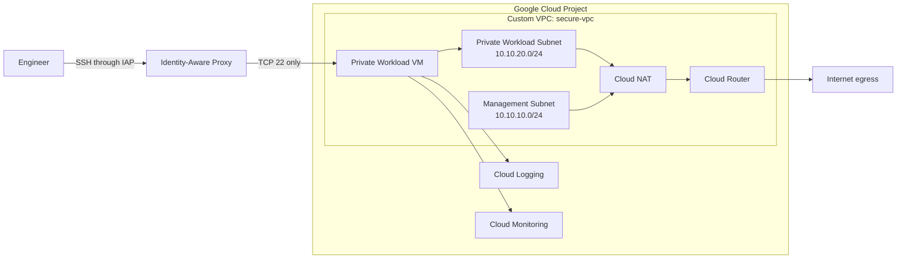

# Secure GCP VPC Infrastructure with Terraform

A beginner-friendly Cloud Engineer portfolio project that builds a secure Google Cloud network with Terraform.

## What this project builds

- Custom-mode VPC
- Management subnet
- Private workload subnet
- VPC Flow Logs on both subnets
- Internal-only workload VM (no external IPv4)
- Cloud Router + Cloud NAT for outbound internet access
- IAP-only SSH firewall rule
- OS Login
- Shielded VM security features
- Dedicated VM service account
- Least-privilege Logging and Monitoring IAM roles

## Architecture



## Important GCP networking note

Unlike AWS terminology, a GCP subnet is not inherently "public" or "private". Whether a VM is directly reachable from the internet depends primarily on its external IP configuration and firewall rules. In this project, the workload VM has **no external IP**, so administrative SSH uses IAP instead.

## Prerequisites

1. A Google Cloud project with billing enabled.
2. Terraform installed.
3. Google Cloud CLI installed.
4. Permissions to enable APIs and create Compute, IAM, and networking resources.

## Authenticate locally

```bash
gcloud auth login
gcloud auth application-default login
gcloud config set project YOUR_GCP_PROJECT_ID
```

Terraform's Google provider can use Application Default Credentials for local development.

## Configure the project

```bash
cp terraform.tfvars.example terraform.tfvars
```

Edit `terraform.tfvars`:

```hcl
project_id = "YOUR_GCP_PROJECT_ID"
region     = "me-central2"
zone       = "me-central2-a"
```

If the selected region/zone is unavailable to your account or lab, replace it with an allowed region and zone.

## Deploy

```bash
terraform init
terraform fmt -recursive
terraform validate
terraform plan
terraform apply
```

Review the plan before typing `yes`.

## Verify

### 1. Check the VM has no external IP

```bash
gcloud compute instances describe private-workload-vm \
  --zone=me-central2-a \
  --format='get(networkInterfaces[0].networkIP,networkInterfaces[0].accessConfigs[0].natIP)'
```

The first value is the private IP. The external NAT IP field should be empty for the VM itself.

### 2. SSH through IAP

```bash
gcloud compute ssh private-workload-vm \
  --zone=me-central2-a \
  --tunnel-through-iap
```

Your Google identity still needs the IAM roles required for IAP TCP forwarding and OS Login.

### 3. Test outbound access through Cloud NAT

Inside the VM:

```bash
curl -I https://www.google.com
```

The VM can initiate outbound connections through Cloud NAT without having a public IP directly attached to it.

## Why each component exists

| Component | Purpose | Skill demonstrated |
|---|---|---|
| Custom VPC | Own network instead of default VPC | GCP networking |
| Regional subnets | Split address space by workload purpose | CIDR/subnetting |
| Firewall rules | Explicitly control ingress traffic | Cloud security |
| IAP SSH | Administrative access without public VM IP | Zero-trust-style access |
| Cloud NAT | Private VM outbound internet connectivity | Routing/NAT |
| Service Account | Machine identity for the workload | IAM |
| Least-privilege IAM | Only Logging/Monitoring write access | Security/IAM |
| VPC Flow Logs | Observe network flows | Logging/troubleshooting |
| OS Login | Identity-based SSH management | Access control |
| Shielded VM | Harden Compute Engine instance | VM security |
| Terraform | Reproducible infrastructure | IaC/automation |

## Folder structure

```text
.
├── versions.tf
├── provider.tf
├── variables.tf
├── apis.tf
├── networking.tf
├── firewall.tf
├── iam.tf
├── compute.tf
├── outputs.tf
├── terraform.tfvars.example
├── .gitignore
└── README.md
```

## Cleanup

To avoid ongoing charges:

```bash
terraform destroy
```

Review the destroy plan and confirm only when you are sure the resources are no longer needed.

## Next versions ان شاء الله

- v2: Dockerized FastAPI app
- v3: Artifact Registry + GitHub Actions CI/CD
- v4: GKE deployment
- v5: HTTPS load balancer, managed certificate, alerting, and dashboards
